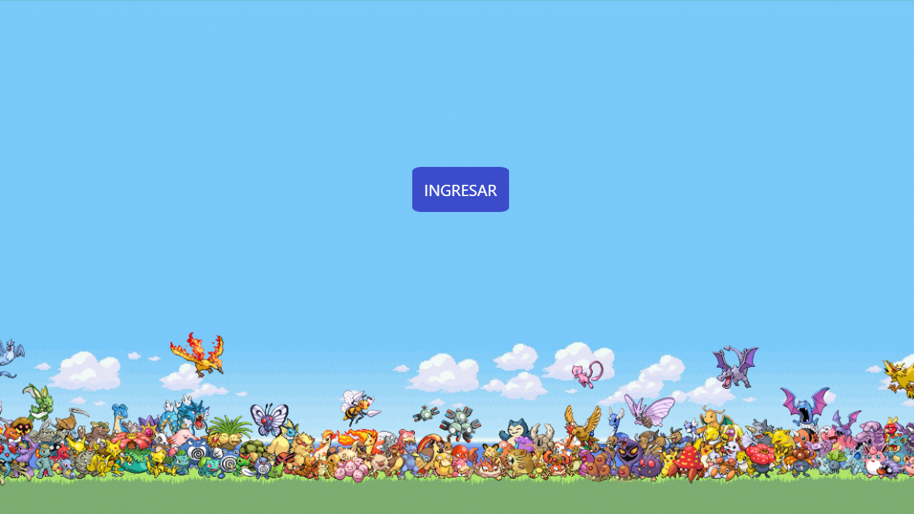
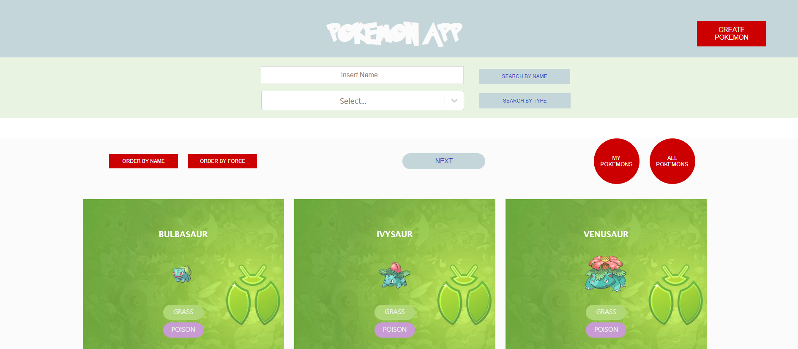
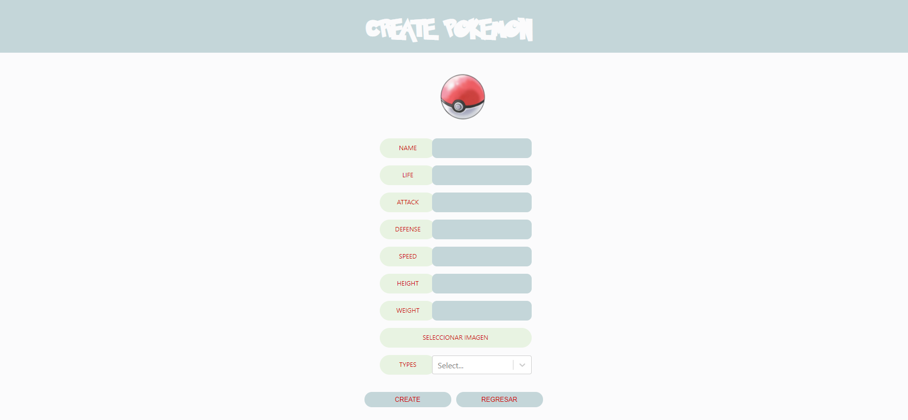
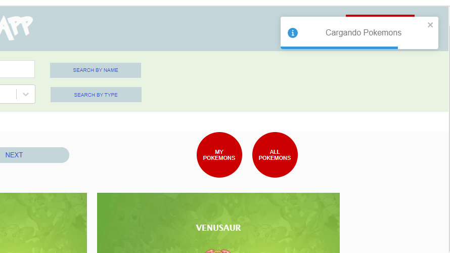

<h2 align="left">PokemonApp</h2>

 
PokemonApp es una aplicacion web desarrollada utilizando NodeJS, Express, Postgresql (Sequelize), React y Redux, usando CSS puro para los estilos. Con PokemonApp es posible ordernar pokemons por su fuerza, buscar por nombre y tipo, y crear tu propio Pokemon
 
  
<a href="https://pokemon-app-estanip.netlify.app/pokemons" target="_blank"> <h5>Ingresa al sitio</h5> </a>

 
  <h4 align="left">Landing<h4>
    
   
  <h4 align="left">Home<h4>
  
   
  <h4 align="left">Form<h4>
  
   
  <h4 align="left">Messages (libreria Toastify)<h4>
  
   

 
 
